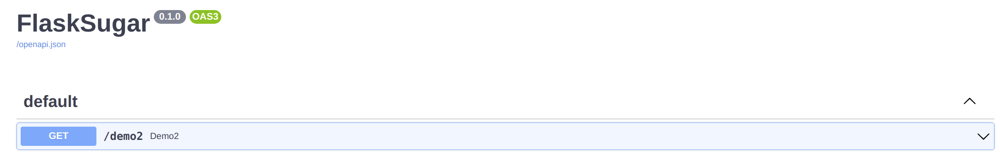
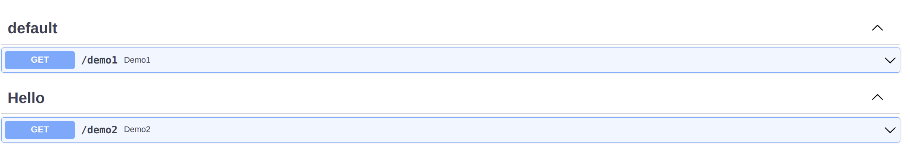
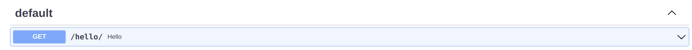
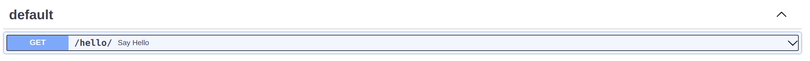
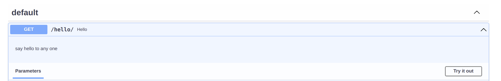
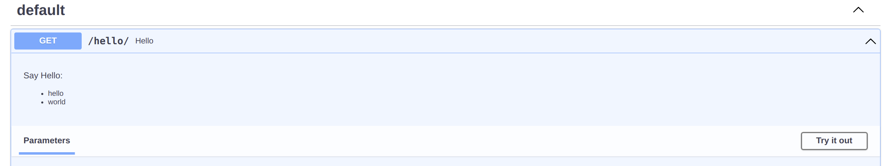
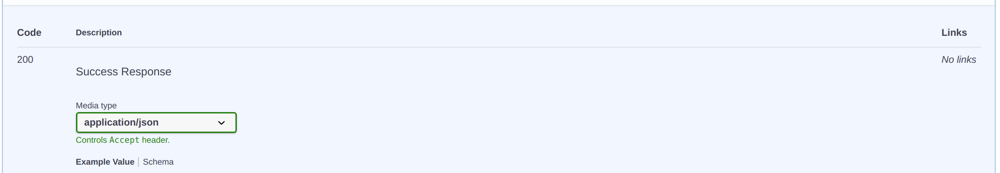
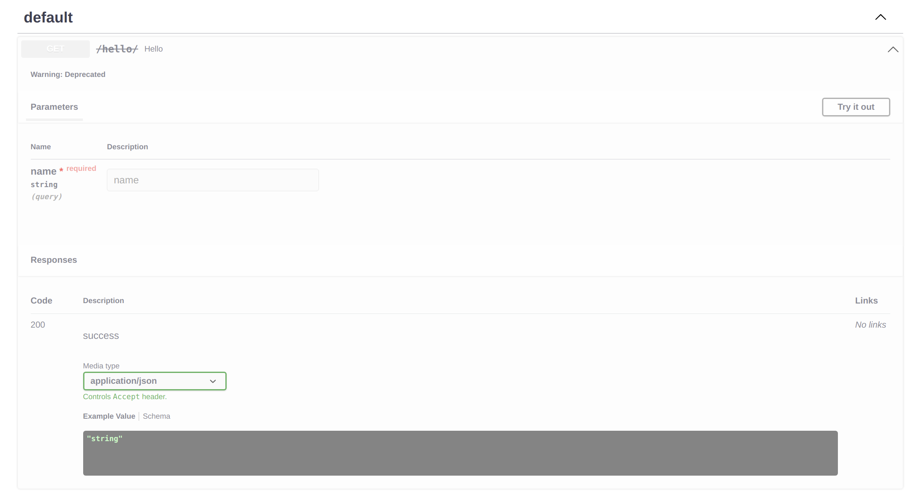

# Operations parameters

## Doc Enable

You can set `doc_enable=False` to hide the doc of current api

```python hl_lines="6"
from flask_sugar import Sugar

app = Sugar(__name__)


@app.get("/demo1", doc_enable=False)
def demo1():
    return {"code": 0}


@app.get("/demo2")
def demo2():
    return {"code": 0}
```



## Tags

You can group your API operations using the `tags` argument (`list[str]`). 
```Python hl_lines="11"
from flask_sugar import Sugar

app = Sugar(__name__)


@app.get("/demo1")
def demo1():
    return {"code": 0}


@app.get("/demo2", tags=["Hello"])
def demo2():
    return {"code": 0}
```

Tagged operations may be handled differently by various tools and libraries. For example, the Swagger UI uses tags to group the displayed operations.



### Blueprint tags

You can use `tags` argument to apply tags to all operations declared by Blueprint:

```Python
from flask_sugar import Sugar, Blueprint

app = Sugar(__name__)

hello_bp = Blueprint("hello", __name__, tags=["world"])


@hello_bp.get("/demo1")
def demo1():
    return {"code": 0}


@hello_bp.get("/demo2")
def demo2():
    return {"code": 0}


app.register_blueprint(hello_bp)
```

!!! note
    the Blueprint tags default value is [`name of the Blueprint`]

## Summary

Summary is a human-readable name for your operation.

By default, it's generated by capitalizing your operation function name:

```Python hl_lines="6"
from flask_sugar import Sugar

app = Sugar(__name__)


@app.get("/hello/")
def hello(name: str):
    return {"hello": name}
```



If you want to override it or translate it to other language, use the `summary` argument in the `api` decorator.

```Python hl_lines="7"
from flask_sugar import Sugar

app = Sugar(__name__)


@app.get("/hello/", summary="Say Hello")
def hello(name: str):
    return {"hello": name}
```



## Description

If you need to provide more information about your operation, use either the `description` argument or normal Python docstrings:


```Python hl_lines="1"
@app.get("/hello/", description="say hello to any one")
def hello(name: str):
    return {"hello": name}
```



When you need to provide a long multi line description, you can use Python `docstrings` for the function definition:

```Python hl_lines="3-7"
@app.get("/hello/")
def hello(name: str):
    """
    Say Hello:
      - hello
      - world
    """
    return {"hello": name}
```



## Response Description

If you need to provide more information about your response, use either the `response_description` argument:

```Python hl_lines="1"
@app.get("/hello/", response_description="Success Response")
def hello(name: str):
    return {"hello": name}
```




## Deprecated

If you need to mark an operation as deprecated without removing it, use the `deprecated` argument:

```Python hl_lines="1"
@app.get("/hello/", deprecated=True)
def hello(name: str):
    return {"hello": name}
```

It will be marked as deprecated in the JSON Schema and also in the interactive OpenAPI docs:



## OperationId

The OpenAPI `operationId` is an optional unique string used to identify an operation. If provided, these IDs must be unique among all operations described in your API.

By default, Flask Sugar sets it to `view endpoint` + `__` + `http method in lower`.

If you want to set it individually for each operation, use the `operation_id` argument:

```Python hl_lines="1"
@app.post("/tasks", operation_id="create_task")
def new_task():
    ...
```
