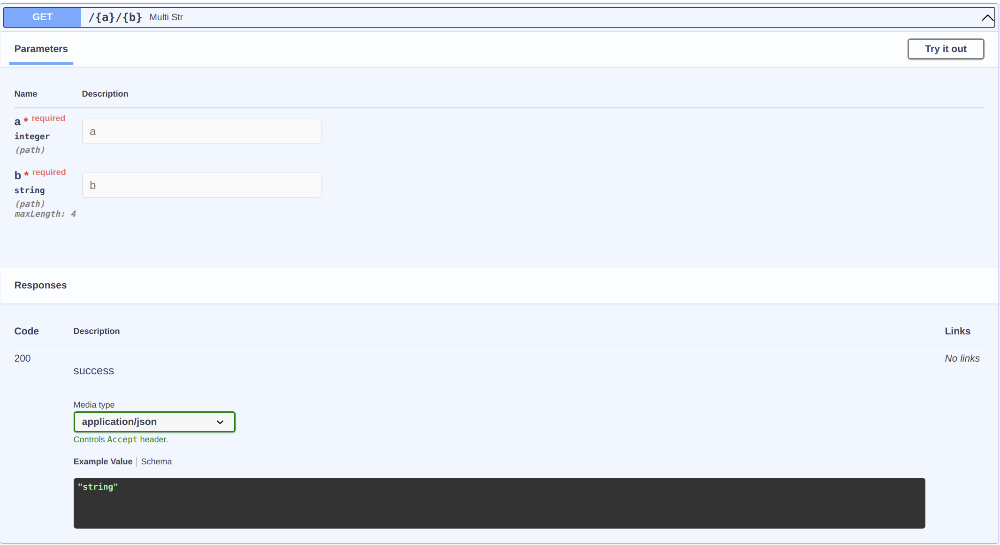

# Path Parameters

## Validation of sugar

```python
from flask_sugar import Sugar

app = Sugar(__name__)


@app.get("/<a>/<b>")
def add_num(a: int, b: int):
    return {"result": a + b}
```

If your path parameters do not meet the rules, you will get a response like this

```json
{
  "detail": [
    [
      {
        "loc": [
          "a"
        ],
        "msg": "value is not a valid integer",
        "type": "type_error.integer"
      },
      {
        "loc": [
          "b"
        ],
        "msg": "value is not a valid integer",
        "type": "type_error.integer"
      }
    ]
  ]
}
```

## Validation of flask

```python
from flask_sugar import Sugar

app = Sugar(__name__)


@app.get("/<int:a>/<int:b>")
def add_num(a, b):
    return {"result": a + b}
```

If your path parameters do not meet the rules, you will get a `not found` response

## Enumerate Parameters

you can use literal to check the parameters

```python
from flask_sugar import Sugar
from typing_extensions import Literal

app = Sugar(__name__)


@app.get("/<int:a>/<int:b>")
def add_num(a: Literal[1, 3, 5], b: int):
    return {"result": a + b}
```

In this example, value of a must in [1, 3, 5]

## More validation by pydantic

```python
from flask_sugar import Sugar, Path

app = Sugar(__name__)


@app.get("/<int:a>/<string:b>")
def multi_str(a: int = Path(..., gt=3), b: str = Path(..., max_length=4)):
    return {"result": a * b}
```

In this example, value of a must greater than 3, length of b must greater than 4

### Documentation

Now, when you open your browser at <http://localhost:5000/doc>, you will see the automatic, interactive, API documentation.

