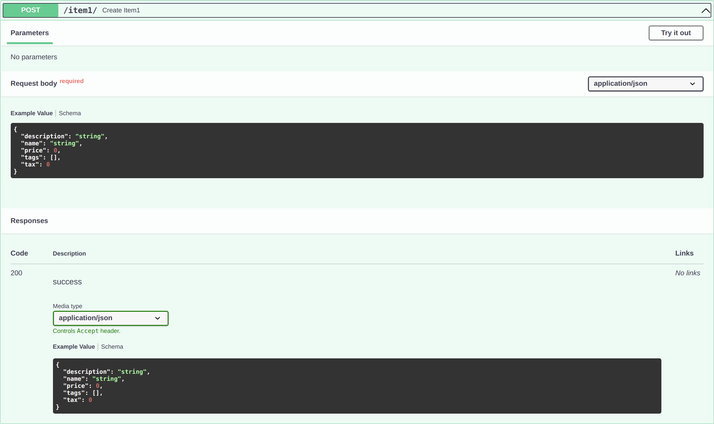

# Response

You can declare the model used for the response with the parameter `response_model` in any of the *path operations*:

* `@app.get()`
* `@app.post()`
* `@app.put()`
* `@app.delete()`

or declare the model/TypedDict in the return value typehint.

## response_model in param

```python hl_lines="17 19 22 24"
from typing import List, Optional

from flask_sugar import Sugar
from pydantic import BaseModel

app = Sugar(__name__)


class Item(BaseModel):
    name: str
    description: Optional[str] = None
    price: float
    tax: Optional[float] = None
    tags: List[str] = []


@app.post("/item1/", response_model=Item)
def create_item1(item: Item):
    return item


@app.post("/item2/", response_model=Item)
def create_item2(item: Item):
    return item.dict()
```



!!! note
    Notice that `response_model` is a parameter of the "decorator" method (`get`, `post`, etc). Not of your *path operation function*, like all the parameters and body.

The returned value can be a model or a dict.

It receives the same type you would declare for a Pydantic model attribute, so, it should be a Pydantic model.

Flask Sugar will use this `response_model` to:

* Convert the output data to its type declaration.
* Validate the data.
* Add a JSON Schema for the response, in the OpenAPI *path operation*.
* Will be used by the automatic documentation systems.

But most importantly:

* Will limit the output data to that of the model. We'll see how that's important below.

!!! note "Technical Details"
    The response model is declared in this parameter instead of as a function return type annotation, because the path function may not actually return that response model but rather return a `dict`, database object or some other model, and then use the `response_model` to perform the field limiting and serialization.

## Model in typehint

```python hl_lines="17"
from typing import List, Optional

from flask_sugar import Sugar
from pydantic import BaseModel

app = Sugar(__name__)


class Item(BaseModel):
    name: str
    description: Optional[str] = None
    price: float
    tax: Optional[float] = None
    tags: List[str] = []


@app.post("/items/")
def create_item(item: Item) -> Item:
    return item
```

It works the same as model in param.

## TypedDict in typehint

```python hl_lines="16"
from typing import List
from typing_extensions import TypedDict

from flask_sugar import Sugar

app = Sugar(__name__)


class UserInfo(TypedDict):
    name: str
    age: int
    tags: List[str]


@app.get("/")
def index() -> UserInfo:
    return {"name": "rockman", "age": 25, "tags": ["a", "b"]}
```

!!! note
    You can't use TypedDict in **path operations** or in **view func**.  
    It only works in return value typehint.

It checks the return value both type check statically and at runtime

## Response Model encoding parameters

Your response model could have default values, like:

```Python hl_lines="11  13-14"
from typing import List, Optional

from flask_sugar import Sugar
from pydantic import BaseModel

app = Sugar(__name__)


class Item(BaseModel):
    name: str
    description: Optional[str] = None
    price: float
    tax: float = 10.5
    tags: List[str] = []


items = {
    "foo": {"name": "Foo", "price": 50.2},
    "bar": {"name": "Bar", "description": "The bartenders", "price": 62, "tax": 20.2},
    "baz": {"name": "Baz", "description": None, "price": 50.2, "tax": 10.5, "tags": []},
}


@app.get("/items/<item_id>", response_model=Item, response_model_exclude_unset=True)
def read_item(item_id: str):
    return items[item_id]
```

* `description: Optional[str] = None` has a default of `None`.
* `tax: float = 10.5` has a default of `10.5`.
* `tags: List[str] = []` as a default of an empty list: `[]`.

but you might want to omit them from the result if they were not actually stored.

For example, if you have models with many optional attributes in a NoSQL database, but you don't want to send very long JSON responses full of default values.


### Use the `response_model_exclude_unset` parameter

You can set the *path operation decorator* parameter `response_model_exclude_unset=True`:

```Python hl_lines="24"
from typing import List, Optional

from flask_sugar import Sugar
from pydantic import BaseModel

app = Sugar(__name__)


class Item(BaseModel):
    name: str
    description: Optional[str] = None
    price: float
    tax: float = 10.5
    tags: List[str] = []


items = {
    "foo": {"name": "Foo", "price": 50.2},
    "bar": {"name": "Bar", "description": "The bartenders", "price": 62, "tax": 20.2},
    "baz": {"name": "Baz", "description": None, "price": 50.2, "tax": 10.5, "tags": []},
}


@app.get("/items/<item_id>", response_model=Item, response_model_exclude_unset=True)
def read_item(item_id: str):
    return items[item_id]
```

and those default values won't be included in the response, only the values actually set.

So, if you send a request to that *path operation* for the item with ID `foo`, the response (not including default values) will be:

```JSON
{
    "name": "Foo",
    "price": 50.2
}
```

!!! info
    Flask Sugar uses Pydantic model's `.dict()` with <a href="https://pydantic-docs.helpmanual.io/usage/exporting_models/#modeldict" class="external-link" target="_blank">its `exclude_unset` parameter</a> to achieve this.

!!! info
    You can also use:

    * `response_model_exclude_defaults=True`
    * `response_model_exclude_none=True`

    as described in <a href="https://pydantic-docs.helpmanual.io/usage/exporting_models/#modeldict" class="external-link" target="_blank">the Pydantic docs</a> for `exclude_defaults` and `exclude_none`.

#### Data with values for fields with defaults

But if your data has values for the model's fields with default values, like the item with ID `bar`:

```Python hl_lines="3  5"
{
    "name": "Bar",
    "description": "The bartenders",
    "price": 62,
    "tax": 20.2
}
```

they will be included in the response.

#### Data with the same values as the defaults

If the data has the same values as the default ones, like the item with ID `baz`:

```Python hl_lines="3  5-6"
{
    "name": "Baz",
    "description": None,
    "price": 50.2,
    "tax": 10.5,
    "tags": []
}
```

Flask Sugar is smart enough (actually, Pydantic is smart enough) to realize that, even though `description`, `tax`, and `tags` have the same values as the defaults, they were set explicitly (instead of taken from the defaults).

So, they will be included in the JSON response.

!!! tip
    Notice that the default values can be anything, not only `None`.

    They can be a list (`[]`), a `float` of `10.5`, etc.

### `response_model_include` and `response_model_exclude`

You can also use the *path operation decorator* parameters `response_model_include` and `response_model_exclude`.

They take a `set` of `str` with the name of the attributes to include (omitting the rest) or to exclude (including the rest).

This can be used as a quick shortcut if you have only one Pydantic model and want to remove some data from the output.

!!! tip
    But it is still recommended to use the ideas above, using multiple classes, instead of these parameters.

    This is because the JSON Schema generated in your app's OpenAPI (and the docs) will still be the one for the complete model, even if you use `response_model_include` or `response_model_exclude` to omit some attributes.

    This also applies to `response_model_by_alias` that works similarly.

```Python hl_lines="31  37"
from typing import Optional

from flask_sugar import Sugar
from pydantic import BaseModel

app = Sugar(__name__)


class Item(BaseModel):
    name: str
    description: Optional[str] = None
    price: float
    tax: float = 10.5


items = {
    "foo": {"name": "Foo", "price": 50.2},
    "bar": {"name": "Bar", "description": "The Bar fighters", "price": 62, "tax": 20.2},
    "baz": {
        "name": "Baz",
        "description": "There goes my baz",
        "price": 50.2,
        "tax": 10.5,
    },
}


@app.get(
    "/items/<item_id>/name",
    response_model=Item,
    response_model_include={"name", "description"},
)
def read_item_name(item_id: str):
    return items[item_id]


@app.get("/items/<item_id>/public", response_model=Item, response_model_exclude={"tax"})
def read_item_public_data(item_id: str):
    return items[item_id]
```

!!! tip
    The syntax `{"name", "description"}` creates a `set` with those two values.

    It is equivalent to `set(["name", "description"])`.

## Recap

Use the *path operation decorator's* parameter `response_model` to define response models and especially to ensure private data is filtered out.

Use `response_model_exclude_unset` to return only the values explicitly set.

