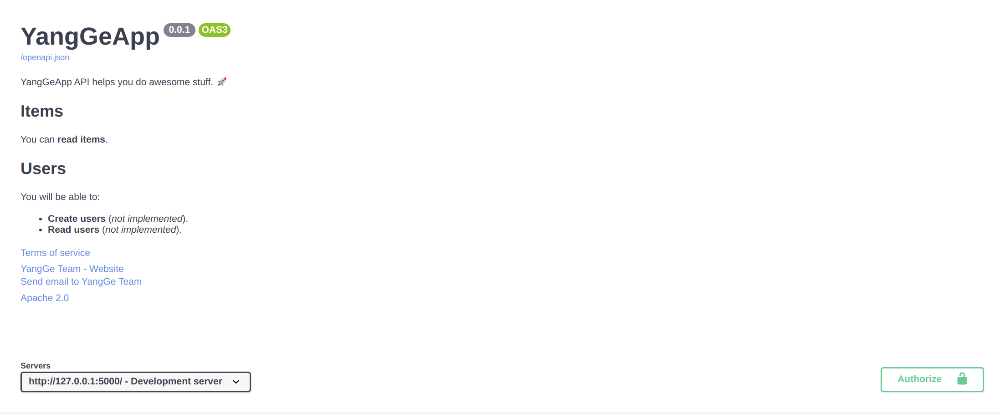
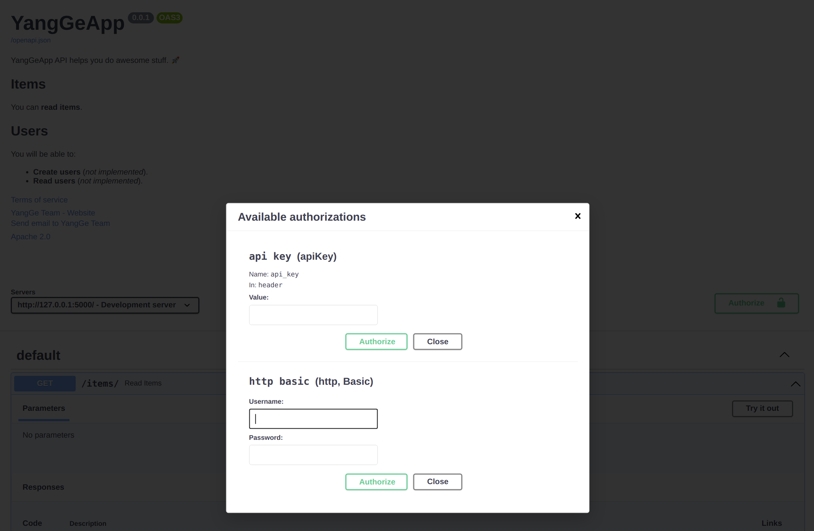
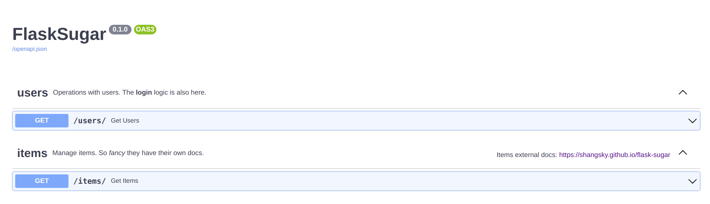

# Sugar Parameters

The following is an introduction to `Sugar` parameters.

## Flask Parameters

If you want to know what these parameters do, see the [flask documentation](https://flask.palletsprojects.com/en/1.0.x/api/#application-object).

| Parameter | Type |
|------------|------|
| `import_name` | `str` |
| `static_url_path` | `str` |
| `static_folder` | `str` |
| `static_host` | `str` |
| `host_matching` | `bool` |
| `subdomain_matching` | `bool` |
| `template_folder` | `str` |
| `instance_path` | `str` |
| `instance_relative_config` | `bool` |
| `root_path` | `str` |

## Metadata for API

You can set the following fields that are used in the OpenAPI specification and the automatic API docs UIs:

| Parameter | Type | Description |
|------------|------|-------------|
| `title` | `str` | The title of the API. |
| `description` | `str` | A short description of the API. It can use Markdown. |
| `doc_version` | `string` | The version of the API. This is the version of your own application, not of OpenAPI. For example `2.5.0`. |
| `terms_service` | `str` | A URL to the Terms of Service for the API. If provided, this has to be a URL. |
| `contact` | `dict` | The contact information for the exposed API. It can contain several fields. <details><summary><code>contact</code> fields</summary><table><thead><tr><th>Parameter</th><th>Type</th><th>Description</th></tr></thead><tbody><tr><td><code>name</code></td><td><code>str</code></td><td>The identifying name of the contact person/organization.</td></tr><tr><td><code>url</code></td><td><code>str</code></td><td>The URL pointing to the contact information. MUST be in the format of a URL.</td></tr><tr><td><code>email</code></td><td><code>str</code></td><td>The email address of the contact person/organization. MUST be in the format of an email address.</td></tr></tbody></table></details> |
| `license_` | `dict` | The license information for the exposed API. It can contain several fields. <details><summary><code>license_</code> fields</summary><table><thead><tr><th>Parameter</th><th>Type</th><th>Description</th></tr></thead><tbody><tr><td><code>name</code></td><td><code>str</code></td><td><strong>REQUIRED</strong> (if a <code>license_</code> is set). The license name used for the API.</td></tr><tr><td><code>url</code></td><td><code>str</code></td><td>A URL to the license used for the API. MUST be in the format of a URL.</td></tr></tbody></table></details> |
| `servers` | `list` | An array of Server Objects, which provide connectivity information to a target server. If the servers property is not provided, or is an empty array, the default value would be a Server Object with a url value of /. |
| `security_schemes` | `dict` | Defines a security scheme that can be used by the operations. Supported schemes are HTTP authentication, an API key (either as a header, a cookie parameter or as a query parameter), OAuth2's common flows (implicit, password, client credentials and authorization code) as defined in RFC6749, and OpenID Connect Discovery.  <details><summary><code>security_schemes</code> fields</summary><table><thead><tr><th>Parameter</th><th>Type</th><th>Description</th></tr></thead><tbody><tr><td><code>type</code></td><td><code>str</code></td><td>REQUIRED. The type of the security scheme. Valid values are "apiKey", "http", "oauth2", "openIdConnect".</td></tr><tr><td><code>description</code></td><td><code>str</code></td><td>A short description for security scheme. CommonMark syntax MAY be used for rich text representation.</td></tr><tr><td><code>name</code></td><td><code>str</code></td><td>	REQUIRED. The name of the header, query or cookie parameter to be used.</td></tr><tr><td><code>in</code></td><td><code>str</code></td><td>	REQUIRED. The location of the API key. Valid values are "query", "header" or "cookie".</td></tr><tr></tr><tr><td><code>etc</code></td></tr></tbody></table></details>|

!!! Tip
    more info in [swagger documentation](https://swagger.io/specification/)

You can set them as follows:

```Python hl_lines="3-16  20-53"
from flask_sugar import Sugar

description = """
YangGeApp API helps you do awesome stuff. 🚀

## Items

You can **read items**.

## Users

You will be able to:

* **Create users** (_not implemented_).
* **Read users** (_not implemented_).
"""

app = Sugar(
    __name__,
    title="YangGeApp",
    description=description,
    doc_version="0.0.1",
    terms_service="http://localhost/terms/",
    contact={
        "name": "YangGe Team",
        "url": "http://localhost/contact/",
        "email": "example@example.com",
    },
    license_={
        "name": "Apache 2.0",
        "url": "https://www.apache.org/licenses/LICENSE-2.0.html",
    },
    servers=[
        {
            "url": "http://127.0.0.1:5000/",
            "description": "Development server",
        },
        {
            "url": "http://localhost:5000/",
            "description": "Staging server",
        },
    ],
    security_schemes={
        "http basic": {
            "type": "http",
            "scheme": "basic"
        },
        "api key": {
            "type": "apiKey",
            "name": "api_key",
            "in": "header"
        }
    }
)


@app.get("/items/")
def read_items():
    return {"name": "YangGe"}
```

!!! tip
    You can write Markdown in the `description` field and it will be rendered in the output.

With this configuration, the automatic API docs would look like:



## Metadata for tags

You can also add additional metadata for the different tags used to group your path operations with the parameter `tags`.

It takes a list containing one dictionary for each tag.

Each dictionary can contain:

* `name` (**required**): a `str` with the same tag name you use in the `tags` parameter in your *path operations* and `Blueprint`s.
* `description`: a `str` with a short description for the tag. It can have Markdown and will be shown in the docs UI.
* `externalDocs`: a `dict` describing external documentation with:
    * `description`: a `str` with a short description for the external docs.
    * `url` (**required**): a `str` with the URL for the external documentation.

### Create metadata for tags

Let's try that in an example with tags for `users` and `items`.

Create metadata for your tags and pass it to the `tags` parameter:

```Python hl_lines="3-16  18"
from flask_sugar import Sugar

tags_metadata = [
    {
        "name": "users",
        "description": "Operations with users. The **login** logic is also here.",
    },
    {
        "name": "items",
        "description": "Manage items. So _fancy_ they have their own docs.",
        "externalDocs": {
            "description": "Items external docs",
            "url": "https://shangsky.github.io/flask-sugar",
        },
    },
]

app = Sugar(__name__, tags=tags_metadata)


@app.get("/users/", tags=["users"])
def get_users():
    return {"users": [{"name": "Harry"}, {"name": "Ron"}]}


@app.get("/items/", tags=["items"])
def get_items():
    return {"items": [{"name": "wand"}, {"name": "flying broom"}]}
```

Notice that you can use Markdown inside of the descriptions, for example "login" will be shown in bold (**login**) and "fancy" will be shown in italics (_fancy_).

!!! tip
    You don't have to add metadata for all the tags that you use.

### Use your tags

Use the `tags` parameter with your *path operations* (and `Blueprint`s) to assign them to different tags:

```Python hl_lines="21  26"
from flask_sugar import Sugar

tags_metadata = [
    {
        "name": "users",
        "description": "Operations with users. The **login** logic is also here.",
    },
    {
        "name": "items",
        "description": "Manage items. So _fancy_ they have their own docs.",
        "externalDocs": {
            "description": "Items external docs",
            "url": "https://shangsky.github.io/flask-sugar",
        },
    },
]

app = Sugar(__name__, tags=tags_metadata)


@app.get("/users/", tags=["users"])
def get_users():
    return {"users": [{"name": "Harry"}, {"name": "Ron"}]}


@app.get("/items/", tags=["items"])
def get_items():
    return {"items": [{"name": "wand"}, {"name": "flying broom"}]}
```

### Check the docs

Now, if you check the docs, they will show all the additional metadata:



### Order of tags

The order of each tag metadata dictionary also defines the order shown in the docs UI.

For example, even though `users` would go after `items` in alphabetical order, it is shown before them, because we added their metadata as the first dictionary in the list.

## Docs Url Parameters

| Parameter | Type | Description |
|------------|------|-------------|
| `openapi_url_prefix` | `str` | The prefix of the api documentation. example: `openapi_url_prefix=/abc`, you should visit the doct at `/abc/doc` and `/abc/redoc`.  |
| `openapi_json_url` | `str` | The url of openapi.json, if `openapi_json_url=None`, api doc will close |
| `swagger_url` | `str` | The url of the swagger doc. |
| `redoc_url` | `str` | The url of the redoc. |
| `swagger_js_url` | `str` | The staic js file url of swagger ui. |
| `swagger_css_url` | `str` | The staic css file url of swagger ui. |
| `redoc_js_url` | `str` | The staic js file url of redoc. |
