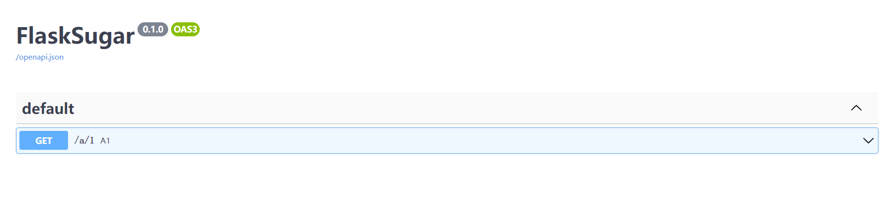

# 文档路由过滤器

你可以使用doc_route_filter，来过滤和设置路由相关的属性

## 例子

过滤掉`/b`开头的路由

```python
from flask_sugar import Sugar

app = Sugar(__name__, doc_route_filter=lambda view, rule: not rule.rule.startswith("/b"))


@app.get("/a/1")
def a1():
    return "a1"


@app.get("/b/1")
def b1():
    return "a2"
```

