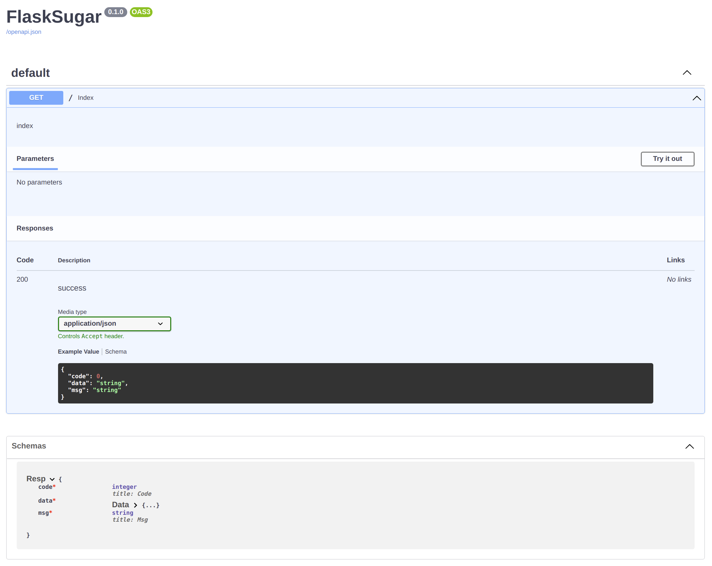
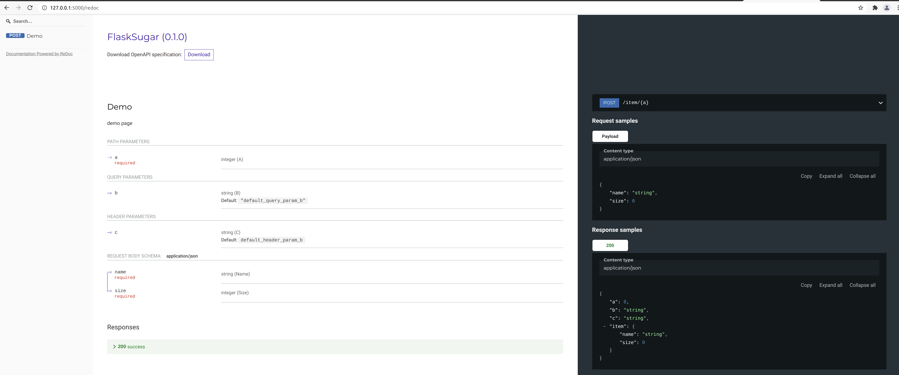

# Flask Sugar

Flask Sugar是一个基于flask, pyddantic和类型注解的API框架.

可以检查参数并自动生成API文档

文档: <https://shangsky.github.io/flask-sugar>

源码: <https://github.com/shangsky/flask-sugar>


## 依赖

- Python 3.6+
- Flask 2.0+

## 安装

```shell
$ pip install flask-sugar
```

## 例子

```python
# 保存为app.py
from flask_sugar import Sugar, Header
from pydantic import BaseModel

app = Sugar(__name__)


class Item(BaseModel):
    name: str
    size: int


class Resp(BaseModel):
    a: int
    b: str
    c: str
    item: Item


@app.post("/item/<a>")
def demo(
    a: int,  # 路径参数
    item: Item,  # 请求体json参数
    b: str = "default_query_param_b",  # 查询参数
    c: str = Header("default_header_param_b"),  # 请求头参数
) -> Resp:
    """demo page"""
    return Resp(a=a, b=b, c=c, item=item)
```

```shell
$ flask run --reload
  * Running on http://127.0.0.1:5000/ (Press CTRL+C to quit)
```

现在访问swagger文档地址 http://localhost:5000/doc:



访问Redoc文档地址 http://localhost:5000/redoc:



## 许可证

此项目使用MIT许可证.