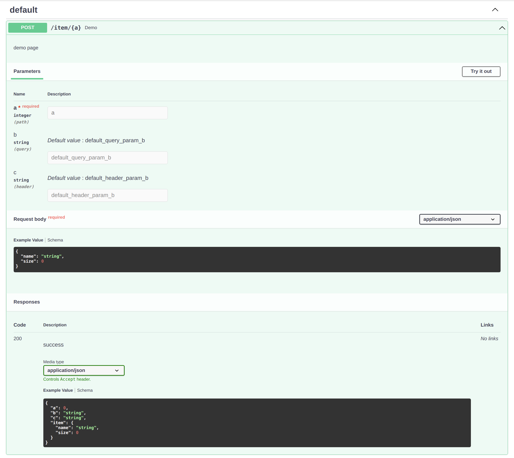

# Flask Sugar

Flask Sugar是一个基于flask, pyddantic和类型注解的API框架.

可以检查参数并自动生成API文档

文档: <https://shangsky.github.io/flask-sugar>

源码: <https://github.com/shangsky/flask-sugar>


## 依赖

- Python 3.6+
- Flask 2.0+

## 安装

```shell
$ pip install flask-sugar
```

## 简单的例子

```python
# 保存为main.py
from typing import Any

from flask_sugar import Sugar
from typing_extensions import TypedDict

app = Sugar(__name__)


class Resp(TypedDict):
    code: int
    msg: str
    data: Any


@app.get("/")
def index() -> Resp:
    """index page"""
    return {"code": 0, "msg": "success", "data": {}}
```

```shell
$ export FLASK_APP=main:app
$ flask run --reload
  * Running on http://127.0.0.1:5000/ (Press CTRL+C to quit)
```

现在访问swagger文档地址 http://localhost:5000/doc:



访问Redoc文档地址 http://localhost:5000/redoc:


## 许可证

此项目使用MIT许可证.