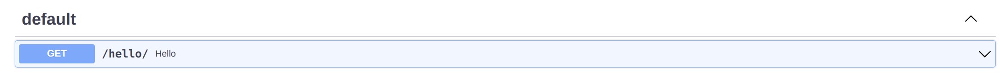

# Operations参数

## 文档生效

你可以设置`doc_enable=False`隐藏这个接口的文档

```python hl_lines="6"
from flask_sugar import Sugar

app = Sugar(__name__)


@app.get("/demo1", doc_enable=False)
def demo1():
    return {"code": 0}


@app.get("/demo2")
def demo2():
    return {"code": 0}
```


## 标签

您可以使用 `tags` 参数（`list[str]`）对 API 操作进行分组。

```Python hl_lines="11"
from flask_sugar import Sugar

app = Sugar(__name__)


@app.get("/demo1")
def demo1():
    return {"code": 0}


@app.get("/demo2", tags=["Hello"])
def demo2():
    return {"code": 0}
```

各种工具和库可能会以不同方式处理视图函数。 例如，Swagger UI 使用标签对显示的视图函数进行分组。


### 蓝图标签

您可以使用 `tags` 参数将标签应用于蓝图声明的所有视图函数，路由继承所属蓝图的标签，您可以设置 `extends_tags=False` 禁用它：

```Python
from flask_sugar import Sugar, Blueprint

app = Sugar(__name__)

hello_bp = Blueprint("hello", __name__, tags=["world"])


@hello_bp.get("/demo1")
def demo1():
    return {"code": 0}


@hello_bp.get("/demo2", extends_tags=False)
def demo2():
    return {"code": 0}


app.register_blueprint(hello_bp)
```

!!! note
    蓝图标签默认值为 [`蓝图的名称`]

## 摘要

Summary是您的操作的可读名称。

默认情况下，它是通过将您的视图函数名称大写生成的：

```Python hl_lines="6"
from flask_sugar import Sugar

app = Sugar(__name__)


@app.get("/hello/")
def hello(name: str):
    return {"hello": name}
```



如果您想覆盖它或将其翻译成其他语言，请使用 `api` 装饰器中的 `summary` 参数。

```Python hl_lines="7"
from flask_sugar import Sugar

app = Sugar(__name__)


@app.get("/hello/", summary="Say Hello")
def hello(name: str):
    return {"hello": name}
```


## 描述

如果您需要提供有关视图函数的更多信息，请使用 `description` 参数或普通 Python 文档字符串：


```Python hl_lines="1"
@app.get("/hello/", description="say hello to any one")
def hello(name: str):
    return {"hello": name}
```


当你需要提供很长的多行描述时，你可以使用 Python `docstrings` 来定义函数：

```Python hl_lines="3-7"
@app.get("/hello/")
def hello(name: str):
    """
    Say Hello:
      - hello
      - world
    """
    return {"hello": name}
```


## 响应描述

如果您需要提供有关您的响应的更多信息，请使用 `response_description` 参数：

```Python hl_lines="1"
@app.get("/hello/", response_description="Success Response")
def hello(name: str):
    return {"hello": name}
```


## 已弃用

如果您需要将视图函数标记为已弃用而不将其删除，请使用 `deprecated` 参数：

```Python hl_lines="1"
@app.get("/hello/", deprecated=True)
def hello(name: str):
    return {"hello": name}
```

它将在 JSON Schema 和交互式 OpenAPI 文档中标记为已弃用：


## OperationID

OpenAPI `operationId` 是一个可选的唯一字符串，用于标识操作。 如果提供，这些 ID 在您的 API 中描述的所有操作中必须是唯一的。

默认情况下，Flask Sugar 将其设置为 `视图的endpoint` + `__` + `小写的http请求方式`。

如果要为每个视图函数单独设置它，请使用 `operation_id` 参数：

```Python hl_lines="1"
@app.post("/tasks", operation_id="create_task")
def new_task():
    ...
```

## Security

声明哪些安全机制可用于此操作。 值列表包括可以使用的替代安全要求对象。 只需满足其中一个安全要求对象即可授权请求。 要使安全性成为可选，可以在数组中包含一个空的安全性要求 ({})。 此定义覆盖任何声明的顶级安全性。 要删除顶级安全声明，可以使用空数组。

## Extra

其余的Operation属性，可以覆盖前面设置所有的属性