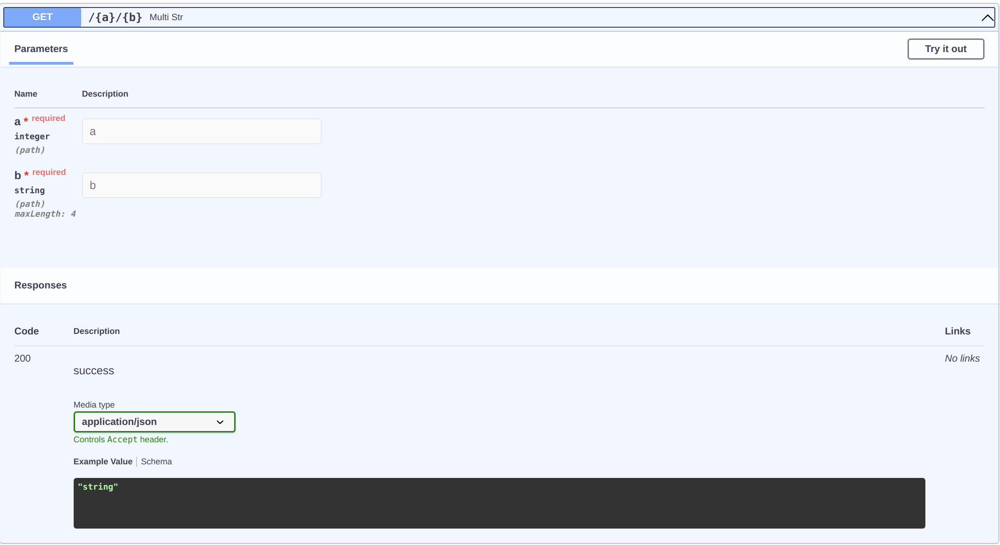

# 路径参数

## 用sugar校验

```python
from flask_sugar import Sugar

app = Sugar(__name__)


@app.get("/<a>/<b>")
def add_num(a: int, b: int):
    return {"result": a + b}
```

如果你的路径参数和参数类型注解不一致，会得到一个这样的响应

```json
{
  "detail": [
    [
      {
        "loc": [
          "a"
        ],
        "msg": "value is not a valid integer",
        "type": "type_error.integer"
      },
      {
        "loc": [
          "b"
        ],
        "msg": "value is not a valid integer",
        "type": "type_error.integer"
      }
    ]
  ]
}
```

## flask校验路径参数

```python
from flask_sugar import Sugar

app = Sugar(__name__)


@app.get("/<int:a>/<int:b>")
def add_num(a, b):
    return {"result": a + b}
```

如果你的路径参数不满足规则，会得到404响应

## 枚举型参数

你可以使用`Literal`去校验参数

```python
from flask_sugar import Sugar
from typing_extensions import Literal

app = Sugar(__name__)


@app.get("/<int:a>/<int:b>")
def add_num(a: Literal[1, 3, 5], b: int):
    return {"result": a + b}
```

这个例子中, a的值必须在[1, 3, 5]中

## 校验更多参数(使用pydantic)

```python
from flask_sugar import Sugar, Path

app = Sugar(__name__)


@app.get("/<int:a>/<string:b>")
def multi_str(a: int = Path(..., gt=3), b: str = Path(..., max_length=4)):
    return {"result": a * b}
```

这个例子中, a的值必须大于3, b的长度必须小于4

### OpenAPI文档

现在，当您在打开浏览器访问http://localhost:5000/doc，您将看到自动、交互式的API文档。

