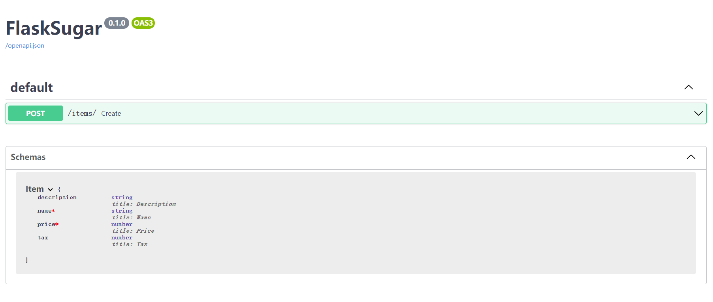
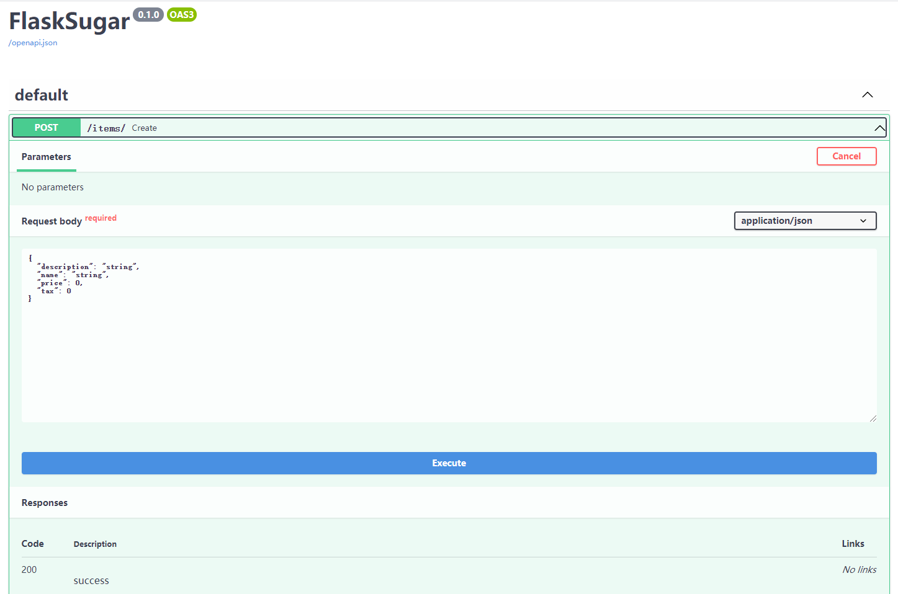

# 请求体

当您需要将数据从客户端（比如浏览器）发送到您的 API 时，您可以将其作为 **request body** 发送。

**request** 正文是客户端发送到您的 API 的数据。 **response** 正文是您的 API 发送给客户端的数据。

您的 API 几乎总是必须发送 **response body**。 但是客户端不一定需要一直发送 **request body**。

要声明 **request body**，您可以使用 <a href="https://pydantic-docs.helpmanual.io/" class="external-link" target="_blank">Pydantic</a> 模型和 他们所有的能力和好处。


## 导入 Pydantic 的 `BaseModel`

首先，你需要从`pydantic`导入`BaseModel`:

```Python hl_lines="4"
from typing import Optional

from flask_sugar import Sugar
from pydantic import BaseModel

app = Sugar(__name__)


class Item(BaseModel):
    name: str
    description: Optional[str] = None
    price: float
    tax: Optional[float] = None


@app.post("/items/")
def create(item: Item):
    return item
```

## 创建您的数据模型

然后将数据模型声明为继承自 BaseModel 的类.

对所有属性使用标准 Python 类型注解:

```Python hl_lines="9-13"
from typing import Optional

from flask_sugar import Sugar
from pydantic import BaseModel

app = Sugar(__name__)


class Item(BaseModel):
    name: str
    description: Optional[str] = None
    price: float
    tax: Optional[float] = None


@app.post("/items/")
def create(item: Item):
    return item
```

与声明查询参数时相同，当模型属性具有默认值时，它不是必需的。 否则，它是必需的。 使用 `None` 使其只是可选的。

例如，上面的这个模型声明了一个 JSON "`object`"（或 Python `dict`），如：

```JSON
{
    "name": "Foo",
    "description": "An optional description",
    "price": 45.2,
    "tax": 3.5
}
```

...由于 description 和 tax 是可选的（默认值为 None），这个 JSON"`object`"也将是有效的:

```JSON
{
    "name": "Foo",
    "price": 45.2
}
```

## 将其声明为参数

要将其添加到您的视图函数中，请按照您声明路径和查询参数的方式对其进行声明:

```Python hl_lines="17"
from typing import Optional

from flask_sugar import Sugar
from pydantic import BaseModel

app = Sugar(__name__)


class Item(BaseModel):
    name: str
    description: Optional[str] = None
    price: float
    tax: Optional[float] = None


@app.post("/items/")
def create(item: Item):
    return item
```

...并将其类型声明为您创建的模型，`Item`.

## 结果

仅使用 Python 类型注解，**Flask Sugar** 将:

* 将请求体作为 JSON 读取。
* 转换为相应的类型（在需要时）。
* 校验数据。
    * 如果数据无效，将返回一条清晰易读的错误信息，指出不正确数据的确切位置和内容。
* 将接收的数据赋值到参数`item`中。
    * 由于你已经在函数中将它声明为`Item`类型，你还将获得对于所有属性及其类型的一切编辑器支持（代码补全等）。
* 为你的模型生成 <a href="https://json-schema.org" class="external-link" target="_blank">JSON 模式</a> 定义，你还可以在其他任何对你的项目有意义的地方使用它们。
* 这些模式将成为生成的 OpenAPI 模式的一部分，并且被自动化文档 <abbr title="用户界面">UI</abbr> 所使用。

## 自动化文档

你所定义模型的 JSON 模式将成为生成的 OpenAPI 模式的一部分，并且在交互式 API 文档中展示：



而且还将在每一个需要它们的*路径操作*的 API 文档中使用：



## 使用模型

在函数内部，你可以直接访问模型对象的所有属性：

```Python hl_lines="20"
from typing import Optional

from flask_sugar import Sugar
from pydantic import BaseModel

app = Sugar(__name__)


class Item(BaseModel):
    name: str
    description: Optional[str] = None
    price: float
    tax: Optional[float] = None


@app.post("/items/")
def create(item: Item):
    item_dict = item.dict()
    if item.tax:
        price_with_tax = item.price + item.tax
        item_dict.update({"price_with_tax": price_with_tax})
    return item_dict
```

## 请求体 + 路径参数

你可以同时声明路径参数和请求体。

**Flask Sugar** 将识别出与路径参数匹配的函数参数应**从路径中获取**，而声明为 Pydantic 模型的函数参数应**从请求体中获取**。

```Python hl_lines="16-17"
from typing import Optional

from flask_sugar import Sugar
from pydantic import BaseModel

app = Sugar(__name__)


class Item(BaseModel):
    name: str
    description: Optional[str] = None
    price: float
    tax: Optional[float] = None


@app.put("/items/<item_id>")
def create(item_id: int, item: Item):
    return {"item_id": item_id, **item.dict()}
```

## 请求体 + 路径参数 + 查询参数

你还可以同时声明**请求体**、**路径参数**和**查询参数**。

**Flask Sugar** 会识别它们中的每一个，并从正确的位置获取数据。

```Python hl_lines="17"
from typing import Optional

from flask_sugar import Sugar
from pydantic import BaseModel

app = Sugar(__name__)


class Item(BaseModel):
    name: str
    description: Optional[str] = None
    price: float
    tax: Optional[float] = None


@app.post("/items/<item_id>")
def create(item_id: int, item: Item, q: Optional[str] = None):
    result = {"item_id": item_id, **item.dict()}
    if q:
        result.update({"q": q})
    return result
```

函数参数将依次按如下规则进行识别：

* 如果在**路径**中也声明了该参数，它将被用作路径参数。
* 如果参数属于**单一类型**（比如 `int`、`float`、`str`、`bool` 等）它将被解释为**查询**参数。
* 如果参数的类型被声明为一个 **Pydantic 模型**，它将被解释为**请求体**。

!!! note
    Flask Sugar将知道`q`的值不是必需的，因为默认值`=None`。

    `Optional[str]`中的`Optional`不被Flask Sugar使用，但它允许编辑器为您提供更好的支持并检测错误。
