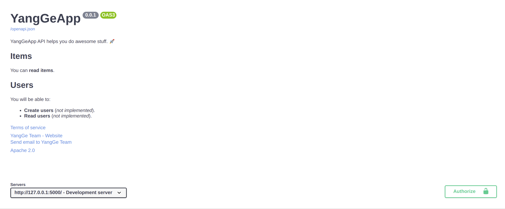
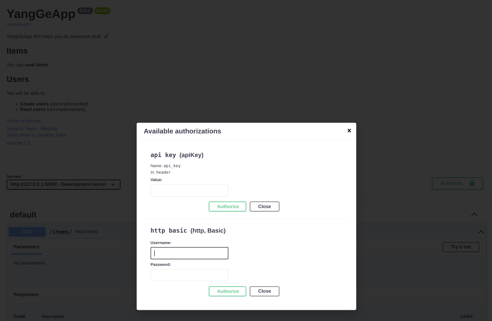

# Sugar的参数

以下是对`Sugar`参数的介绍。

## Flask的参数

如果您想知道这些参数的作用，请参阅[flask文档](https://flask.palletsprojects.com/en/1.0.x/api/#application-object).

| 参数 | 类型 |
|------------|------|
| `import_name` | `str` |
| `static_url_path` | `str` |
| `static_folder` | `str` |
| `static_host` | `str` |
| `host_matching` | `bool` |
| `subdomain_matching` | `bool` |
| `template_folder` | `str` |
| `instance_path` | `str` |
| `instance_relative_config` | `bool` |
| `root_path` | `str` |

## API元数据

你可以设置这些字段来改变在 OpenAPI 和自动 API 文档用户界面:

| 参数 | 类型 | 描述 |
|------------|------|-------------|
| `title` | `str` | 文档的标题 |
| `description` | `str` | 文档的描述，可以使用markdown语法 |
| `doc_version` | `string` | API 的版本。 这是您自己的应用程序的版本，而不是 OpenAPI 的版本。 例如`2.5.0`。 |
| `terms_service` | `str` | API 服务条款的 URL。 如果提供，这必须是一个 URL。 |
| `contact` | `dict` | 公开 API 的联系信息，它可以包含多个字段。 <details><summary><code>contact</code> 字段</summary><table><thead><tr><th>参数</th><th>类型</th><th>描述</th></tr></thead><tbody><tr><td><code>name</code></td><td><code>str</code></td><td>联系人/组织的识别名称。</td></tr><tr><td><code>url</code></td><td><code>str</code></td><td>指向联系信息的 URL。 必须采用 URL 格式。</td></tr><tr><td><code>email</code></td><td><code>str</code></td><td>联系人/组织的电子邮件地址， 必须采用电子邮件地址的格式。</td></tr></tbody></table></details> |
| `license_` | `dict` | 公开 API 的许可证书信息，它可以包含多个字段。<details><summary><code>license_</code> 字段</summary><table><thead><tr><th>参数</th><th>类型</th><th>描述</th></tr></thead><tbody><tr><td><code>name</code></td><td><code>str</code></td><td><strong>必须的</strong> (如果设置了<code>license_</code>). 用于 API 的许可证的名称。</td></tr><tr><td><code>url</code></td><td><code>str</code></td><td>用于 API 的许可证的 URL。 必须采用 URL 格式。</td></tr></tbody></table></details> |
| `servers` | `list` | 一组服务器对象，提供与目标服务器的连接信息。 如果未提供服务器属性，或者提供一个空数组，则默认值将是一个 url 值为 / 的服务器对象。 |
| `security_schemes` | `dict` | 定义操作可以使用的安全方案。 支持的方案是 HTTP 身份验证、API 密钥（作为标头、cookie 参数或作为查询参数）、OAuth2 的常见流程（隐式、密码、客户端凭据和授权代码），如 RFC6749 和 OpenID Connect Discovery 中所定义。<details><summary><code>security_schemes</code> 字段</summary><table><thead><tr><th>参数</th><th>类型</th><th>描述</th></tr></thead><tbody><tr><td><code>type</code></td><td><code>str</code></td><td>必须的. 安全方案的类型。 有效值为“apiKey”、“http”、“oauth2”、“openIdConnect”。</td></tr><tr><td><code>description</code></td><td><code>str</code></td><td>安全方案的简短描述。 CommonMark 语法可以用于富文本表示。</td></tr><tr><td><code>name</code></td><td><code>str</code></td><td>	必须的. 要使用的标头、查询或 cookie 参数的名称。</td></tr><tr><td><code>in</code></td><td><code>str</code></td><td>	必须的. API 密钥的位置。 有效值为“查询”、“标题”或“cookie”。</td></tr><tr></tr><tr><td><code>等等</code></td></tr></tbody></table></details>|

!!! Tip
    更多的信息在[swagger文档](https://swagger.io/specification/)

你可以这样设定：

```Python hl_lines="3-16  20-53"
from flask_sugar import Sugar

description = """
YangGeApp API helps you do awesome stuff. 🚀

## Items

You can **read items**.

## Users

You will be able to:

* **Create users** (_not implemented_).
* **Read users** (_not implemented_).
"""

app = Sugar(
    __name__,
    title="YangGeApp",
    description=description,
    doc_version="0.0.1",
    terms_service="http://localhost/terms/",
    contact={
        "name": "YangGe Team",
        "url": "http://localhost/contact/",
        "email": "example@example.com",
    },
    license_={
        "name": "Apache 2.0",
        "url": "https://www.apache.org/licenses/LICENSE-2.0.html",
    },
    servers=[
        {
            "url": "http://127.0.0.1:5000/",
            "description": "Development server",
        },
        {
            "url": "http://localhost:5000/",
            "description": "Staging server",
        },
    ],
    security_schemes={
        "http basic": {
            "type": "http",
            "scheme": "basic"
        },
        "api key": {
            "type": "apiKey",
            "name": "api_key",
            "in": "header"
        }
    }
)


@app.get("/items/")
def read_items():
    return {"name": "YangGe"}
```

!!! tip
    你可以在`description`中使用Markdown语法，在文档页面中会被解析

通过这样设置，自动 API 文档看起来会像：




## 标签元数据

你也可以使用参数 `tags`，为用于分组路径操作的不同标签添加额外的元数据。

它接受一个列表，这个列表包含每个标签对应的一个字典。

每个字典可以包含：

* `name`（**必要**）：一个 `str`，它与*路径操作*和 `Blueprint` 中使用的 `tags` 参数有相同的标签名。
* `description`：一个用于简短描述标签的 `str`。它支持 Markdown 并且会在文档用户界面中显示。
* `externalDocs`：一个描述外部文档的 `dict`：
    * `description`：用于简短描述外部文档的 `str`。
    * `url`（**必要**）：外部文档的 URL `str`。

### 创建标签元数据

让我们在带有标签的示例中为 `users` 和 `items` 试一下。

创建标签元数据并把它传递给 `tags` 参数：

```Python hl_lines="3-16  18"
from flask_sugar import Sugar

tags_metadata = [
    {
        "name": "users",
        "description": "Operations with users. The **login** logic is also here.",
    },
    {
        "name": "items",
        "description": "Manage items. So _fancy_ they have their own docs.",
        "externalDocs": {
            "description": "Items external docs",
            "url": "https://shangsky.github.io/flask-sugar",
        },
    },
]

app = Sugar(__name__, tags=tags_metadata)


@app.get("/users/", tags=["users"])
def get_users():
    return {"users": [{"name": "Harry"}, {"name": "Ron"}]}


@app.get("/items/", tags=["items"])
def get_items():
    return {"items": [{"name": "wand"}, {"name": "flying broom"}]}
```

注意你可以在描述内使用 Markdown，例如「login」会显示为粗体（**login**）以及「fancy」会显示为斜体（_fancy_）。

!!! 提示
    不必为你使用的所有标签都添加元数据。

### 使用你的标签

将 `tags` 参数和*路径操作*（以及 `Blueprint`）一起使用，将其分配给不同的标签：

```Python hl_lines="21  26"
from flask_sugar import Sugar

tags_metadata = [
    {
        "name": "users",
        "description": "Operations with users. The **login** logic is also here.",
    },
    {
        "name": "items",
        "description": "Manage items. So _fancy_ they have their own docs.",
        "externalDocs": {
            "description": "Items external docs",
            "url": "https://shangsky.github.io/flask-sugar",
        },
    },
]

app = Sugar(__name__, tags=tags_metadata)


@app.get("/users/", tags=["users"])
def get_users():
    return {"users": [{"name": "Harry"}, {"name": "Ron"}]}


@app.get("/items/", tags=["items"])
def get_items():
    return {"items": [{"name": "wand"}, {"name": "flying broom"}]}
```

### 查看文档

如果你现在查看文档，它们会显示所有附加的元数据：


### 标签顺序

每个标签元数据字典的顺序也定义了在文档用户界面显示的顺序。

例如按照字母顺序，即使 `users` 排在 `items` 之后，它也会显示在前面，因为我们将它的元数据添加为列表内的第一个字典。

## 文档Url参数

| 参数 | 类型 | 描述 |
|------------|------|-------------|
| `openapi_url_prefix` | `str` | 文档的url前缀. 如: `openapi_url_prefix=/abc`, 文档地址将会是 `/abc/doc` and `/abc/redoc`.  |
| `openapi_json_url` | `str` | openapi.json的url, 如果 `openapi_json_url=None`, api文档将会关闭 |
| `swagger_url` | `str` | swagger文档的url. |
| `redoc_url` | `str` | redoc文档的url. |
| `swagger_js_url` | `str` | swagger ui的js文件地址. |
| `swagger_css_url` | `str` | swagger ui的css文件地址. |
| `redoc_js_url` | `str` | redoc的js文件地址. |
